# TryHackMe - Lazy Admin WriteUp

Walkthrough de la máquina Lazy Admin de TryHackMe. A través de este documento se expondrán los pasos seguidos para vulnerar y completar la máquina Lazy Admin.

## Índice

- [Recon](#recon)
- [Gain Access](#gain-access)
- [Escalate](#escalate)
- [Looting](#looting)

## Recon

Comenzamos escaneando la IP de la máquina con nmap, donde encontramos un servidor web y el puerto SSH abierto.

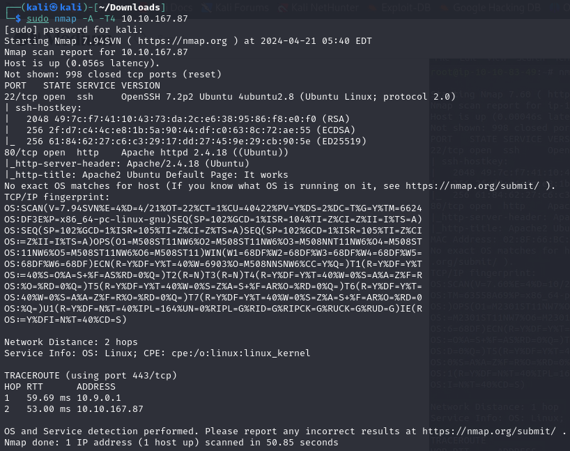

Accedemos al navegador, e introducimos la IP de la máquina seguida del puerto 80, y nos topamos con la página por defecto de Apache.

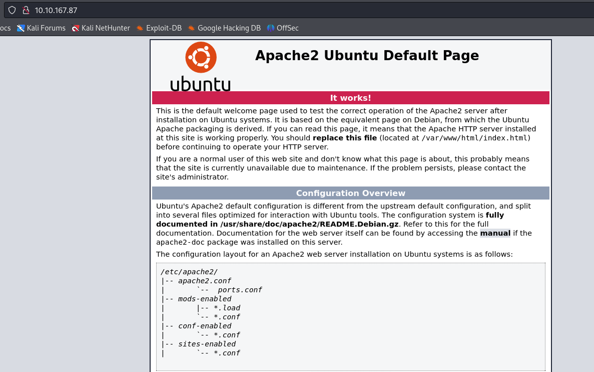

Como ya sabemos que tiene un servidor web hosteado en la VM, usaremos **gobuster** para descubrir posibles directorios ocultos.

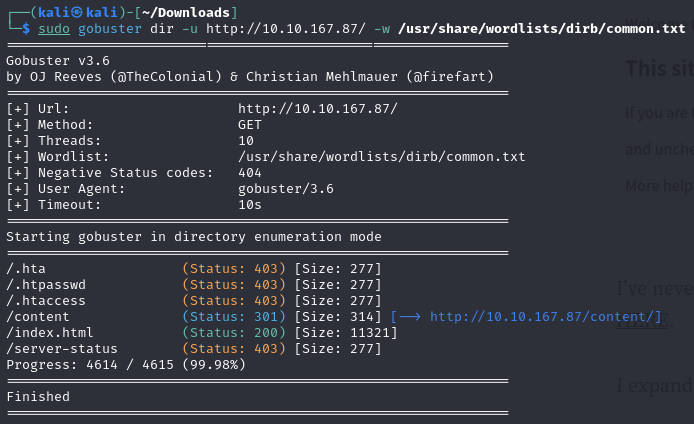

El directorio /content está disponible, de modo que lo revisamos personalmente.

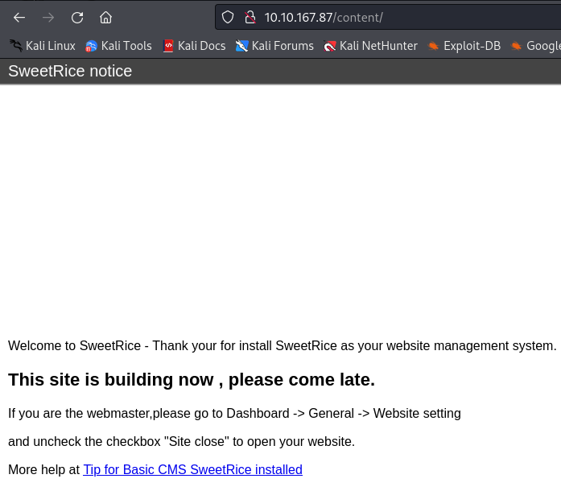

Vemos que tiene instalado un servicio web conocido como *Sweetrice*. A partir de aquí, volveremos a usar gobuster, pero partiendo del directorio */content*.

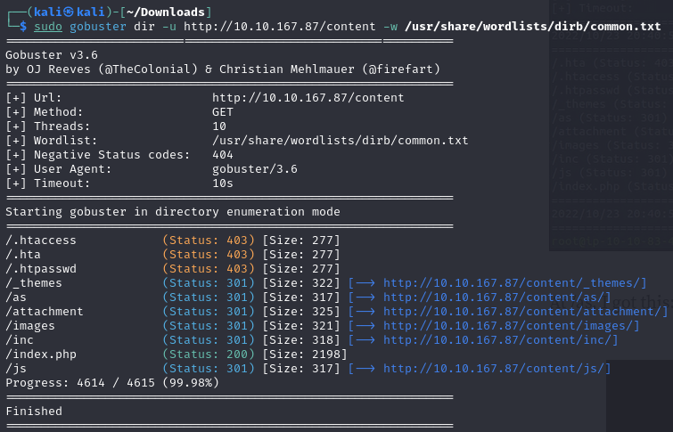

Si revisamos los directorios */as* y */inc*, nos encontraremos con un formulario de inicio de sesión y un conjuntos de ficheros.

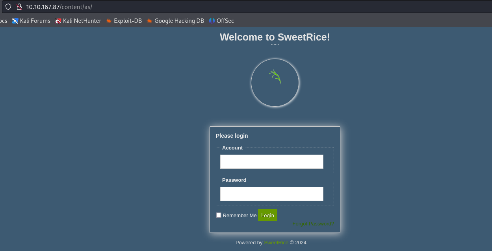

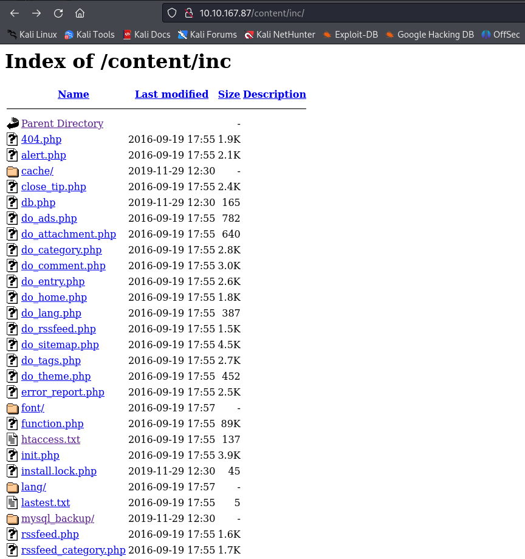

Si analizamos con el comando **strings** el fichero **mysql_backup**, notaremos la existencia de un usuario **manager** seguido de un **hash**. Si desciframos este hash puede que encontremos la contraseña del usuario *manager*.

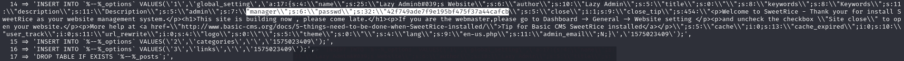

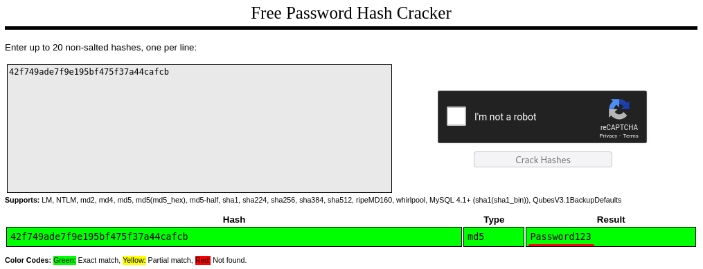

Ya tenemos el usuario **manager** y la contraseña **Password123**, las cuales emplearemos en el formulario de inicio de sesión alojado en */as*. Una vez dentro, activaremos la página web oprimiendo el botón *Running*. 

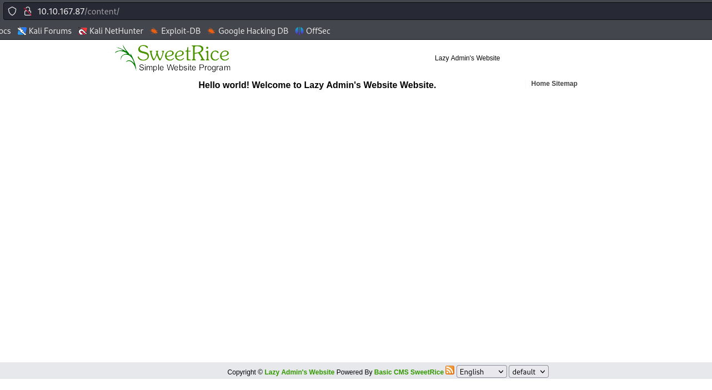

## Gain Access

Como sabemos que la versión de SweetRice es la 1.5.1, buscamos un exploit para dicha versión. Encontramos un exploit de tipo Cross-Site Request Forgery que emplea la ejecución de código PHP, por lo tanto lo descargamos.

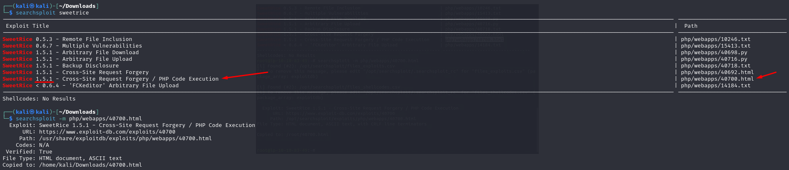

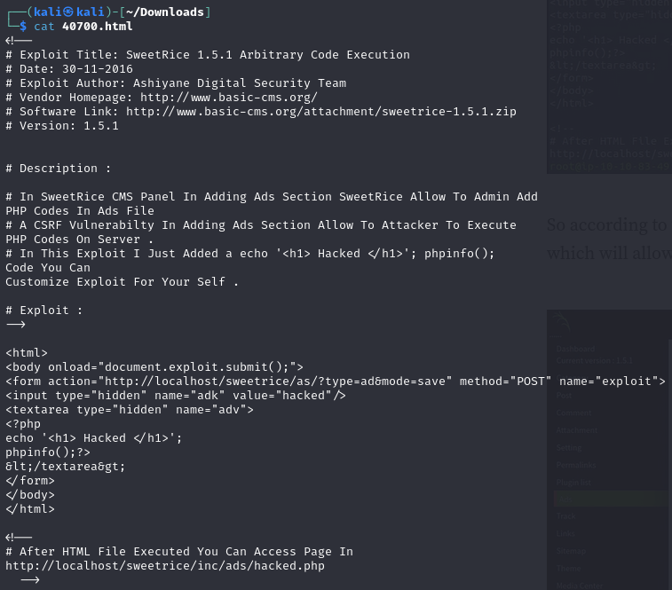

Según lo mostrado en el fichero del exploit, debemos ir a la pestaña Ads de la página web, donde subiremos el código PHP malicioso.

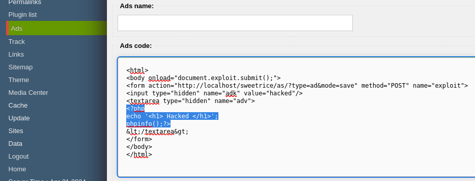

La sección en PHP que se nos proporciona será cambiada por la que vemos en [este repositorio de Github](https://github.com/pentestmonkey/php-reverse-shell/blob/master/php-reverse-shell.php). Donde pone IP, obviamente pondremos la dirección IP de nuestro host.

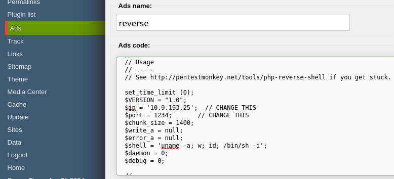

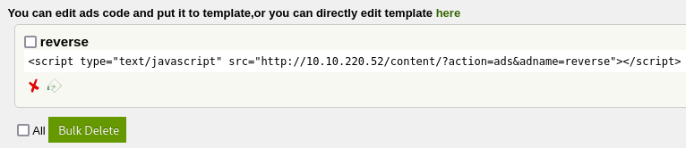

Oprimiremos el botón *DONE* y subiremos el fichero, el cual podremos ver en el directorio */content/inc/ads*. Luego, escucharemos con **Netcat** en el puerto **1234**, que es el que pusimos en el fichero PHP. Obviamente nos aseguraremos de estar escuchando antes de ejecutar el archivo.

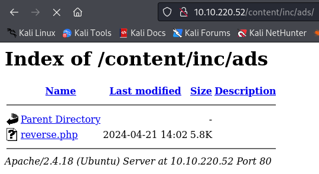

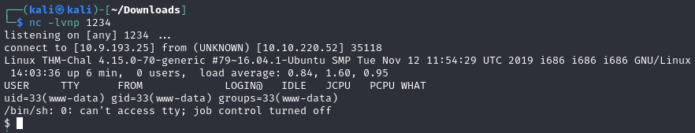

Mejoraremos la shell obtenida con el comando de Python siguiente:  
`python -c 'import pty; pty.spawn("/bin/bash")'`.

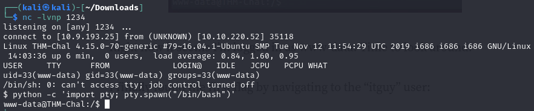

Si navegamos por el directorio */home/itguy* encontraremos la primera flag en el archivo **user.txt**. Si ejecutamos el comando `sudo -l` se nos informará que podemos modificar el archivo **backup.pl** sin necesidad de una contraseña. 

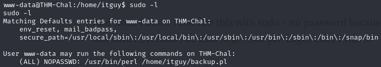

## Escalate

Si miramos el contenido del script en Perl mencionado arriba notaremos que se referencia otro script en bash denominado como **copy.sh**. Lo alteraremos para poder obtener una shell con privilegios de root, ya que este script pertenece a dicho usuario. Una vez alterado, lo ejecutaremos desde el primer script en Perl, que SÍ podemos ejecutar directamente.

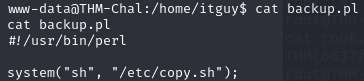

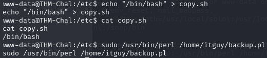

## Looting

Una vez obtenidos privilegios de administrador, buscaremos la última bandera. Para ello, iremos al directorio *root*, donde se encuentra el archivo **root.txt**.

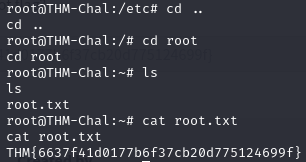